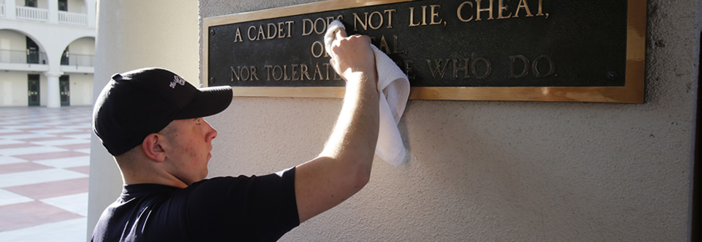

# Hello Honor Code
## CSCI 201

### Objectives
* To learn the basic structure of a simple Python program
* To learn to use an integrated development environment (IDE) to write and run Python programs
* To learn to use the `check50` and `submit50` online submission system

## Overview
In computer programming, a "hello world" program is the usually the first program someone writes to test the very basics of a language. You will create such a program in Python, but instead of "Hello World", you will display a heading followed by the Citadel Honor Code in the 3-line format pictured here (grammatical concerns aside).



```
A CADET DOES NOT LIE, CHEAT, 
OR STEAL, 
NOR TOLERATE THOSE WHO DO.
```
## AI and Collaboration Policy
You may use the Duck Debugger embedded within https://cs50.dev to ask questions about your code, about the Python language, error messages, etc. You may access this same tool at https://cs50.ai if you prefer. **No other generative AI usage is permitted.** 

This pset problem is an **individual assignment**. You may discuss the instructions with classmates but you may not view their code or show yours.

You may ask (and help answer) general questions publicly on Ed Discussion as long as you do not reveal your source code. You may reveal your code in private posts to the instructors. You may ask CS department tutors, faculty, and CSCI 201 alumni for advice, and you may reveal your code to them.

**You must be able to verbally explain and defend all submitted code.**


## Code Organization
Work in https://cs50.dev after following all setup instructions on Canvas.

Create a directory called `honor` and a new Python script called `honor.py` in the directory. You can do this with the following commands:

```
mkdir honor
cd honor
code honor.py
```

## Program Specification
Since all students, not just Cadets, must follow an honor code, your program must first prompt the user for their student type. You may assume that the user of your program will enter `cadet` or `student` with no need for you to verify. Next, output the Honor Code exactly as specified above, **except that your program must insert the student type entered, in uppercase**. You can see a few sample runs in the terminal video below.

[](https://asciinema.org/a/xAOHuItk65ngEcSjIose4SrSk)

## Testing
Run your program in the terminal with the command: `python honor.py`. You must be in the same directory as the `.py` file for this to work. Interact with your program and make sure it runs as expected.

Next, you can check your code against the instructor's test cases by running the command below. If you do not pass all the checks, debug your program and continue the process. Once you are done, take a screenshot of your terminal with the passing test cases shown.

```
check50 citadelcs/problems/main/honor
```

## Submission
Once you are satisfied (or out of time), you need to submit by the deadline. You may resubmit as many times as you like before the deadline to try and improve your score. This process happens in two distinct steps.

### Step 1: submit50
`submit50` is similar to `check50`, except that it *submits* to the instructors. (`check50` is for you.) Run the command below, agree to the honor policy, and confirm submission by clicking the link given in the terminal.

```
check50 citadelcs/problems/main/honor
```

### Step 2: Canvas
After running `submit50`, follow the instructions to submit the assignment on Canvas. This will involve a copy of your Python code, the `submit50` link, and a screenshot of your `check50` checks.

